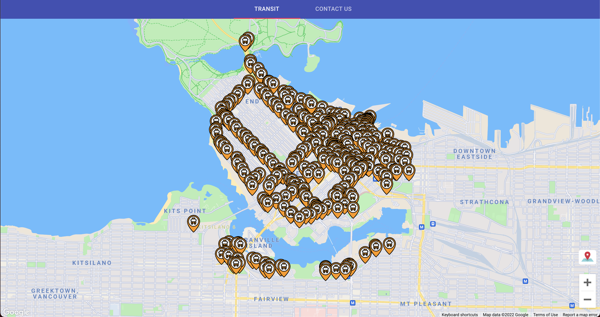
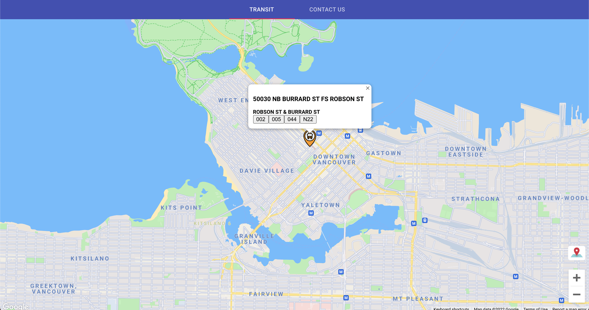
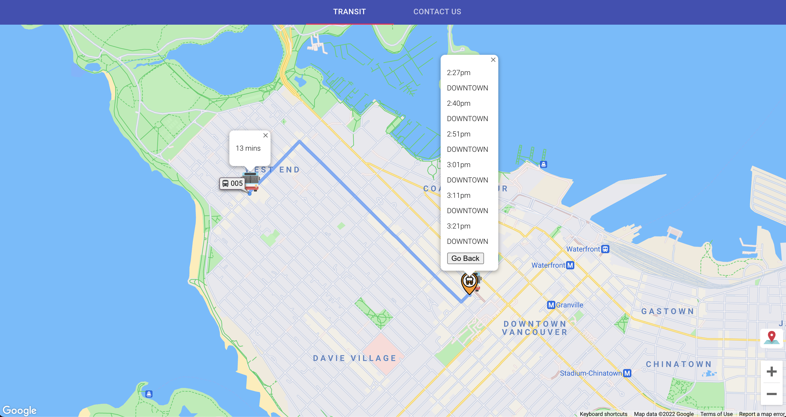
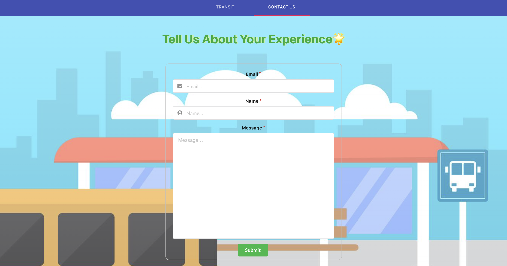

# Vancouver Transit Web Application

Vancouver Transit App (VTA) is a React.js project that retrieves bus time and location from TransLink API.

Live Demo: https://www.vancouver-transit.com/

## Installation

In the project directory, run:

```bash
npm install && npm start
```

## Screenshots






## Tech Stack

### Frontend
- React.Js
- Google Map API

### Backend
- Node.Js
- TransLink API
- EmailJS

## Available Scripts

In the project directory, you can run:

### `npm install` && `npm start`

